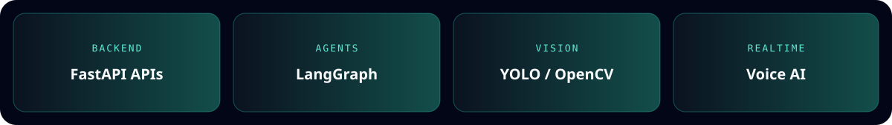
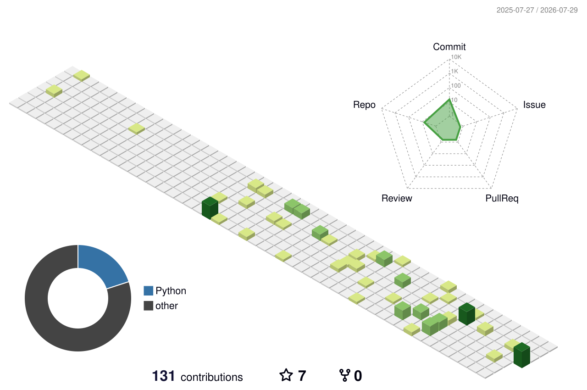

<!-- Custom visual system — not a generic template -->

  

   

  
  
  
  

    

  

  

  

   

  

  

## Arsenal

  

## Signal

  <table>
    <tr>
      <td>
        
      </td>
      <td>
        
      </td>
    </tr>
  </table>

   

  

  

## 3D Contribution Field

  

  

## Contribution Snake

  <picture>
    <source media="(prefers-color-scheme: dark)" srcset="https://raw.githubusercontent.com/mebi-ali/mebi-ali/output/github-snake-dark.svg"/>
    <source media="(prefers-color-scheme: light)" srcset="https://raw.githubusercontent.com/mebi-ali/mebi-ali/output/github-snake.svg"/>
    
  </picture>

---

**Previously** Software Engineer @ Xloop · Data Engineer @ Digitized Planet (UK)  
**Education** B.S. Computer Science — FAST University

 

